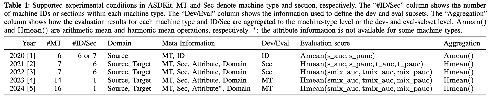
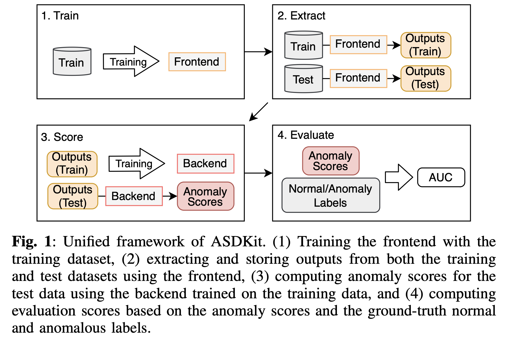
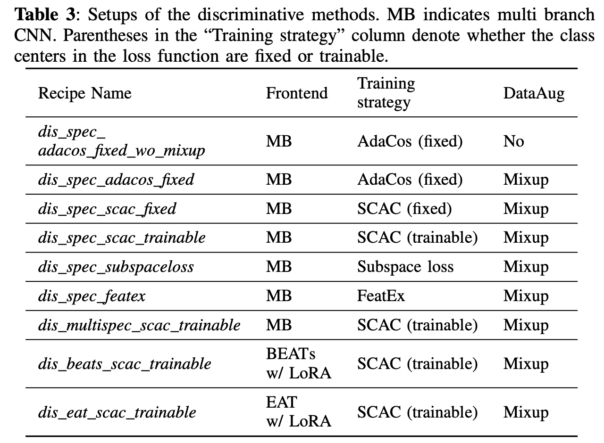
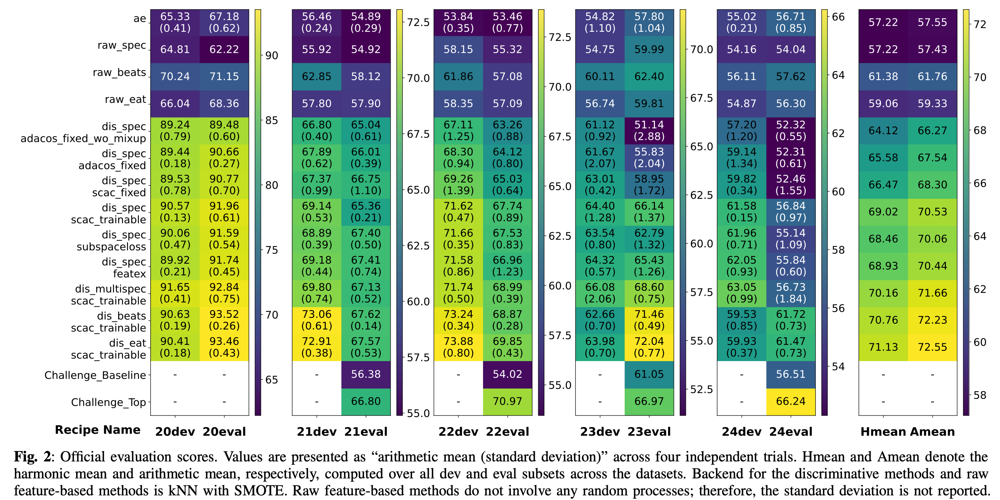

# 🧰 ASDKit: A Toolkit for Comprehensive Evaluation of Anomalous Sound Detection Methods ⛏️

[](https://arxiv.org/abs/2507.10264)

ASDKit is a toolkit for anomalous sound detection (ASD) task.
<br>
ASDKit provides recipes for various ASD methods and supports evaluation on the DCASE 2020-2024 Task 2 datasets.


## 🚀 Easy Start

<details>
<summary>1. Clone and install this repository</summary>
<br>

**How to**

```bash
[somewhere]$ git clone https://github.com/TakuyaFujimura/dcase-asd-toolkit.git
[somewhere]$ cd dcase-asd-toolkit
[dcase-asd-toolkit]$ pip install -e . # Requires Python 3.10+
[dcase-asd-toolkit]$ pip install -r requirements.txt # The full environment used in our experiments
```

</details>

<details>
<summary>2. Download the DCASE Task 2 datasets</summary>
<br>

**How to**
- Specify both `data_dir` and `dcase` in `jobs/download/run.sh`.
- `data_dir`: The directory where the dataset will be stored. By default, it is set to the parent directory of this repository. If you change this, make sure to update `data_dir` in the other scripts accordingly.
- `dcase`: The name of the dataset. Available options are: `dcase2021`, `dcase2022`, `dcase2023`, and `dcase2024`.

```bash
[dcase-asd-toolkit]$ cd jobs/download
[dcase-asd-toolkit/jobs/download]$ bash run.sh
```

**Result**

```bash
<data_dir>
└── original
    └── <dcase>
```
</details>

<details>
<summary>3. Format the dataset</summary>
<br>

This process creates a formatted dataset in which the filename format and dataset structure are unified across all DCASE versions.  
Additionally, it assigns ground-truth normal/anomalous labels to the test data. These labels are concealed during the challenge and released by the organizers afterward.


**How to**

- Specify `data_dir`, `dcase`, and `link_mode` in `jobs/format/run.sh`.
- `link_mode`:  
    - If set `link_mode` to `symlink`, symbolic links with formatted filenames will be created. This mode does not modify the original files.  
    - If set to `link_mode` to `mv`, the original files will be directly renamed using the formatted filenames.
- On Windows, creating symbolic links needs to be allowed (```Settings > System > For Developers```).


```bash
[dcase-asd-toolkit]$ cd jobs/format
[dcase-asd-toolkit/jobs/format]$ bash run.sh
```

**Result**

```bash
<data_dir>
├── original
│   └── <dcase>
└── formatted
    └── <dcase>
```


</details>

<details>
<summary>4. Execute the training and evaluation recipe</summary>
<br>

This script automatically performs the training and evaluation processes.

**How to**
- Specify `data_dir` in `config/train/main.yaml` and `config/extract/main.yaml`.
- Specify `dcase` in `jobs/asd/call/?.sh` (and `seed` if needed).


```bash
[dcase-asd-toolkit]$ cd jobs/asd/call
[dcase-asd-toolkit/jobs/asd/call]$ bash dis_spec_scac_trainable.sh
```

**Result**
```bash
dcase-asd-toolkit
├── asdkit
├── ...
└── results
    └── <name> # `recipe`
        └── <dcase>
            └── <version> # `dis_spec_scac_trainable
                └── <seed> # `0`
                    ├── model
                    │   └── <model_ver> # all
                    │       ├── .hydra
                    │       ├── checkpoints/
                    │       ├── events.out.tfevents.*
                    │       ├── hparams.yaml
                    │       └── train.log
                    └── output
                        └── <infer_ver> # `last`
                            ├── bandsaw
                            ├── bearing
                            ├── ...
                            ├── valve
                            │   ├── test_evaluate.csv # Evaluation results
                            │   ├── test_extract.npz # Extracted test data information
                            │   ├── test_score.csv # Anomaly scores for test data
                            │   ├── train_extract.npz # Extracted training data information
                            │   ├── train_score.csv # Anomaly scores for training data
                            │   └── visualize/ # UMAP visualization
                            │── dev_official23.csv # Summarized evaluation results for dev subsets
                            │── ...
                            └── eval_official23.csv # Summarized evaluation results for eval subsets
```

</details>

<details>
<summary>(5. Setups to use pre-trained models)</summary>

To use pre-trained models, please follow the additional setup steps below.
This setups is required for the following recipes:
`raw_beats`, `raw_eat`, `dis_beats_scac_trainable`, and `dis_eat_scac_trainable`

**For `raw_beats` and `dis_beats_scac_trainable`**
1. Download the BEATs pre-trained model from [this URL](https://onedrive.live.com/?authkey=%21ACVDQ8YOHlNK%5Frw&id=6B83B49411CA81A7%2125969&cid=6B83B49411CA81A7&parId=root&parQt=sharedby&o=OneUp)
2. Place the downloaded file into `dcase-asd-toolkit/pretrained_models/beats/`

**For `raw_eat` and `dis_eat_scac_trainable`**
1. Download the EAT pre-trained model from [this URL](https://drive.google.com/file/d/10pklbY_fKraQUIBizSg1kv4lJXNWxpxl/view)
2. Place the downloaded file into `dcase-asd-toolkit/pretrained_models/eat/`
3. Install fairseq by running the following commands:
```bash
cd dcase-asd-toolkit/jobs/install
bash install_fairseq.sh
```
</details>

## 📋 Supported Experimental Conditions
ASDKit supports the DCASE 2020-2024 conditions.
Across these conditions, the machine types, the provided meta-information labels, and the evaluation scores differ.
For all conditions, the datasets are divided into official *dev* and *eval* subsets, and evaluation scores are aggregated separately for each subset.
The evaluation score is based on a combination of several types of AUC.
ASDKit automatically computes the official evaluation scores according to the respective DCASE year.



### Supported Evaluation Metrics

| Metrics       | Description |
|---------------|-------------|
| s_auc / s_pauc | AUC / pAUC computed using normal and anomalous sounds in the source domain. |
| t_auc / t_pauc | AUC / pAUC computed using normal and anomalous sounds in the target domain. |
| mix_auc / pauc | AUC / pAUC computed using normal and anomalous sounds from both the source and target domains. |
| smix_auc       | AUC computed using normal and anomalous sounds in the source domain and anomalous sounds in the target domain. |
| tmix_auc       | AUC computed using normal and anomalous sounds in the target domain and anomalous sounds in the source domain. |
| official20-24  | Official evaluation score for DCASE 2020-2024 Challenge Task2. These are computed combining the above metrics. |


## ⚒️ Supported Methods
ASDKit handles various ASD methods in a unified framework.
All ASD methods consist of *frontend* and *backend* modules, where the frontend extracts some features from audio signals, and the backend computes anomaly scores after processing these features.
<br>
Recipes in `jobs/asd/recipe/` define the processing flow within this framework.
<br>
Call scripts in `jobs/asd/call/` serve as wrappers for these recipes, allowing easy execution with different seeds, datasets, and configurations.




<br>
In the following, we explain the ASD methods supported by ASDKit and their processing pipelines within this four-step framework.

<details>
<summary>Autoencoder</summary>
<br>

- [AE-based official DCASE baseline](https://dcase.community/documents/workshop2020/proceedings/DCASE2020Workshop_Koizumi_3.pdf)
- Description: This method trains an AE network to reconstruct audio features of normal sounds. It computes anomaly scores based on the reconstruction error for a given observation.
- Call Script: `jobs/asd/call/ae.sh`
- Recipe: `jobs/asd/recipe/ae.sh`
    -  This method directly computes anomaly scores based on the reconstruction error of encountered test samples in the second step, and in the third step, the backend simply copies these anomaly scores.
    - The AE is independently trained for each machine type, repeating steps 1-4 for each machine type.
```bash
# jobs/asd/recipe/ae.sh

experiments_train="ae" # config/train/experiments/ae.yaml
experiments_extract="restore/machinewise" # config/extract/experiments/restore/machinewise.yaml
experiments_score="no_backend" # config/score/experiments/no_backend.yaml

for machine in $machines; do
    asdkit_train machine="${machine}" experiments="${experiments_train}"
    asdkit_extract experiments="${experiments_extract}"
    asdkit_score experiments="${experiments_score}"
    asdkit_evaluate
done
```

</details>


<details>
<summary>Discriminative Methods</summary>
<br>

|  Component | Supported Options |
|:------|:-----|
| Frontend | [Dual-branch CNN](https://ieeexplore.ieee.org/document/10097176), [Multi-branch CNN](https://ieeexplore.ieee.org/document/10890020), [BEATs and EAT w/ LoRA](https://ieeexplore.ieee.org/document/10832335) |
| Loss Function | [ArcFace](https://ieeexplore.ieee.org/document/8953658), [AdaCos](https://ieeexplore.ieee.org/document/8953896), [Sub-cluster AdaCos](https://ieeexplore.ieee.org/document/9534290), [AdaProj](https://dcase.community/documents/workshop2024/proceedings/DCASE2024Workshop_Wilkinghoff_1.pdf) |
| Data Augmentation | [Mixup](https://arxiv.org/abs/1710.09412), [SpecAug](https://www.isca-archive.org/interspeech_2019/park19e_interspeech.pdf) |
| Other Techniques | [FeatEx](https://ieeexplore.ieee.org/document/10447156), [Subspace Loss](https://ieeexplore.ieee.org/document/10890020) |
| Backend | kNN, [kNN w/ Kmeans]((https://ieeexplore.ieee.org/document/10097176)), [kNN w/ SMOTE](https://ieeexplore.ieee.org/document/10889514), [kNN w/ Rescaling](https://ieeexplore.ieee.org/document/10888402) |


- Description: This approach trains a discriminative feature extractor to classify meta-information labels associated with normal training data, and then computes anomaly scores in the discriminative feature space.
- Call Script: `jobs/asd/call/dis_*.sh`
- Recipe: `jobs/asd/recipe/dis_any.sh`
    - The discriminative methods train a common frontend using data from all machine types, and then independently train the backend for each machine type by repeating steps 2-4 for each machine type.

```bash
# jobs/asd/recipe/dis_any.sh

experiments_train="dis_*" # config/train/experiments/dis_*.yaml
experiments_extract="restore/shared" # config/extract/experiments/restore/shared.yaml
experiments_score="default" # config/score/experiments/default.yaml

asdkit_train experiments="${experiments_train}"
for machine in $machines; do
    asdkit_extract experiments="${experiments_extract}"
    asdkit_score experiments="${experiments_score}"
    asdkit_evaluate
done
```
</details>


<details>
<summary>Raw Feature Methods</summary>
<br>


|  Component | Supported Options |
|:------|:-----|
| Frontend | [Spectrogram](https://ieeexplore.ieee.org/document/10096356), [BEATs](https://ieeexplore.ieee.org/document/10887974), EAT|
| Backend | kNN, [kNN w/ Kmeans]((https://ieeexplore.ieee.org/document/10097176)), [kNN w/ SMOTE](https://ieeexplore.ieee.org/document/10889514), [kNN w/ Rescaling](https://ieeexplore.ieee.org/document/10888402) |


- Description: In this method, a frontend extracts raw features without training of meta-information label classification.
- Call Script: `jobs/asd/call/raw_*.sh`
- Recipe: `jobs/asd/recipe/raw_*.sh`
    -  This method repeats steps 2-4 for each machine type, skipping the frontend training in the first step.

```bash
# jobs/asd/recipe/raw_*.sh

experiments_extract="scratch/raw_*" # config/extract/experiments/scratch/raw_*.yaml
experiments_score="default" # config/score/experiments/default.yaml

for machine in $machines; do
    asdkit_extract experiments="${experiments_extract}"
    asdkit_score experiments="${experiments_score}"
    asdkit_evaluate
done
```
</details>

## 📊 Results
We re-evaluated various ASD methods using ASDKit on multiple datasets, conducting four independent trials for each.
<br>
The recipes shown in the figure are provided in `jobs/asd/call/`.
<details>
<summary>Setups of the discriminative methods</summary>
<br>

</details>
<br>



## Information

[Other details](./docs/details.md)
<details><summary>Third Party Code and Licenses</summary>

This project includes the following third-party components:

**BEATs**
- Source: https://github.com/microsoft/unilm/tree/master/beats
- License: MIT
- Location: `asdkit/models/pretrained_models/beats`
- Copyright (c) Microsoft Corporation

**EAT**
- Source: https://github.com/cwx-worst-one/EAT
- License: MIT
- Location: `asdkit/models/pretrained_models/eat`
- Copyright (c) 2024 Wenxi Chen
</details>


### Author

Takuya Fujimura, Nagoya University, Japan
<br>
E-mail: fujimura.takuya@g.sp.m.is.nagoya-u.ac.jp

Kevin Wilkinghoff, Aalborg University and Pioneer Centre for Artificial Intelligence, Denmark

### Citation
```
@article{fujimura2025asdkit,
    title={{ASDKit}: A Toolkit for Comprehensive Evaluation of Anomalous Sound Detection Methods}, 
    author={Fujimura, Takuya and Wilkinghoff, Kevin and Imoto, Keisuke and Toda, Tomoki},
    journal={arXiv preprint arXiv:2507.10264},
    year={2025}
}
```
