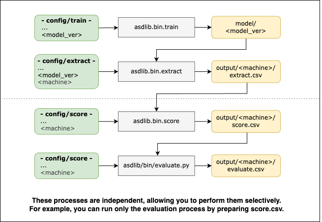
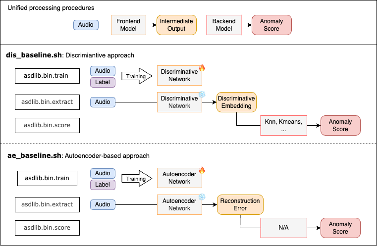

# DCASE Anomalous Sound Detection Library

This repository provides various recipes for the DCASE Task 2 Anomalous Sound Detection (ASD).

## Easy Start

<details>
<summary>1. Clone and install this repository</summary>
<br>

**How to**

```bash
[somewhere]$ git clone https://github.com/TakuyaFujimura/dcase-asd-library.git
[somewhere]$ cd dcase-asd-library
[dcase-asd-library]$ python3 -m venv venv # Requires Python 3.10+
[dcase-asd-library]$ source venv/bin/activate
[dcase-asd-library]$ pip install -e .
```

</details>

<details>
<summary>2. Download the DCASE Task 2 dataset</summary>
<br>

**How to**
- Specify `data_dir` and `dcase` in `jobs/download/run.sh`
- `data_dir`: The directory where the dataset will be stored. The default is set to the parent directory of this repository. If unchanged, you do not need to modify `data_dir` in other scripts.
- `dcase`: The dataset name (`dcase2021`, `dcase2022`, `dcase2023`, `dcase2024` are available)

```bash
[dcase-asd-library]$ cd jobs/download
[dcase-asd-library/jobs/download]$ bash run.sh
```

**Result**

```bash
<data_dir>
└── original
    ├── <dcase>
    └── ...
```
</details>

<details>
<summary>3. Format the dataset</summary>
<br>

**How to**

- Specify `data_dir` and `dcase` in `jobs/format/run.sh`
- This process creates a formatted dataset by generating symbolic links to the original dataset (without modifying the original files).
- Normal/anomalous ground truth labels for test data are added during this process.

```bash
[dcase-asd-library]$ cd jobs/format
[dcase-asd-library/jobs/format]$ bash run.sh
```

**Result**

```bash
<data_dir>
├── original
│   ├── <dcase>
│   └── ...
└── formatted
    ├── <dcase>
    └── ...
```

</details>

<details>
<summary>4. Execute the training/testing recipe</summary>
<br>

**How to**
- Specify `data_dir` in `config/train/config.yaml`
- Specify `dcase` in `jobs/asd/example/?.sh`
    - Two example scripts are provided: `dis_baseline.sh` and `ae_baseline.sh`
- This process will automatically execute the training and testing pipeline.


```bash
[dcase-asd-library]$ cd jobs/asd/example
[dcase-asd-library/jobs/asd/example]$ bash dis_baseline.sh
```

**Result**
```bash
dcase-asd-library
├── asdlib
├── ...
└── results
    ├── ...
    └── <name> # `example`
        ├── ...
        └── <version> # `dcase2023_baseline_0`
            ├── model
            │   └── <model_ver> # all
            │       ├── .hydra
            │       ├── checkpoints
            │       ├── events.out.tfevents.*
            │       ├── hparams.yaml
            │       └── train.log
            └── output
                └── <ckpt_ver> # `epoch_12`
                    ├── bandsaw
                    ├── bearing
                    ├── ...
                    ├── valve
                    │   ├── hparams.yaml
                    │   ├── test_evaluate.csv # AUC scores on test data
                    │   ├── test_extract.csv # Extracted test data information, including embedding values
                    │   ├── test_score.csv # Anomaly scores for test data
                    │   ├── train_extract.csv # Extracted training data information, including embedding values
                    │   ├── train_score.csv # Anomaly scores for training data
                    │   └── umap # UMAP visualization
                    │── official23-dev.csv # Summarized evaluation results
                    └── official23-eval.csv
```

</details>


## Main Tools

<div style="display: flex; justify-content: center;">
    
    
</div>

The example scripts are based on these tools.
These tools load and merge configurations from `config/<tool>/config.yaml`, `config/<tool>/experiments/<experiments>.yaml`, and command-line arguments.


<details>
<summary>asdlib.bin.train</summary>
<br>

```bash
# jobs/asd/base/base.sh
python -m asdlib.bin.train experiments="${name}/${version}" 'seed='${seed}'' \
'name='${name}'' 'version='${version}''
```

- **Role**: Trains the frontend model
- **Result**: Saves the model to `results/<name>/<version>/model/<model_ver>`

</details>

<details>
<summary>asdlib.bin.extract</summary>
<br>

```bash
# jobs/asd/base/base.sh
python -m asdlib.bin.extract experiments="${extract_exp}" \
'name='${name}'' 'version='${version}'' 'seed='${seed}'' \
'ckpt_ver='${ckpt_ver}'' 'machine='${machine}''
```

- **Role**: Extracts test/training data information with the trained frontend model
- **Arguments**:
    - `ckpt_ver`: Checkpoint version of the trained frontend model
    - `machine`: Machine type (e.g., `fan`, `slider`, etc.)
- **Result**: Saves the extracted data to `results/<name>/<version>/output/<ckpt_ver>/<machine>//*_extract.csv`

</details>

<details>
<summary>asdlib.bin.score</summary>
<br>

```bash
# jobs/asd/base/base.sh
python -m asdlib.bin.score experiments="${score_exp}" \
'name='${name}'' 'version='${version}'' 'seed='${seed}'' \
'ckpt_ver='${ckpt_ver}'' 'machine='${machine}''
```

- **Role**: Calculates anomaly scores for test/training data with the extracted information
- **Arguments**: 
    - Specifies the file path for extracted information: `results/<name>/<version>/output/<ckpt_ver>/*_extract.csv`
    - The backend model is specified in `config/score/experiments/<experiments>.yaml`
- **Result**: Saves the anomaly scores to `results/<name>/<version>/output/<ckpt_ver>/<machine>//*_score.csv`

</details>


<details>
<summary>asdlib.bin.evaluate</summary>
<br>

```bash
# jobs/asd/base/base.sh
python -m asdlib.bin.evaluate experiments="${evaluate_exp}" \
'name='${name}'' 'version='${version}'' 'seed='${seed}'' \
'ckpt_ver='${ckpt_ver}'' 'machine='${machine}''
```

- **Role**: Evaluates the anomaly detection performance
- **Arguments**: Specifies the file path for estimated anomaly scores: `results/<name>/<version>/output/<ckpt_ver>/*_score.csv`
- **Result**: Saves the evaluation results to `results/<name>/<version>/output/<ckpt_ver>/<machine>/*_evaluate.csv`

</details>

<details>
<summary>asdlib.bin.umap</summary>
<br>

```bash
# jobs/asd/base/base.sh
python -m asdlib.bin.umap experiments="${umap_exp}" \
'name='${name}'' 'version='${version}'' 'seed='${seed}'' \
'ckpt_ver='${ckpt_ver}'' 'machine='${machine}''
```

- **Role**: Extracts and visualizes UMAP embeddings
- **Arguments**: Specifies the file path for extracted information: `results/<name>/<version>/output/<ckpt_ver>/*_extract.csv`
- **Result**: Saves results to `results/<name>/<version>/output/<ckpt_ver>/<machine>/umap`

</details>


<details>
<summary>asdlib.bin.table</summary>
<br>

```bash
# jobs/asd/base/base.sh
python -m asdlib.bin.table dcase="${dcase}" \
'name='${name}'' 'version='${version}'' 'seed='${seed}'' \
'ckpt_ver='${ckpt_ver}''
```

- **Role**: Summarizes the evaluation results
- **Arguments**: Specifies the evaluation file path `results/<name>/<version>/output/<ckpt_ver>/*_evaluate.csv`
- **Result**: Saves results to `results/<name>/<version>/output/<ckpt_ver>/*.csv`

</details>

## Other Details
- `jobs/asd/base/base.sh` is a helpful wrapper script; however, you can, of course, create your own scripts using the tools above and customized configuration files.
- `dis_baseline.sh` uses a shared frontend model for all machines, while `ae_baseline.sh` uses individual frontend models for each machine.
- `config/*/config.yaml` includes the `overwrite` parameter, which is a flag to overwrite existing files in each process. The default is set to `False` in `config.yaml`.

## Information

### References

### Author

Takuya Fujimura, Toda Laboratory, Nagoya University  
E-mail: fujimura.takuya@g.sp.m.is.nagoya-u.ac.jp
