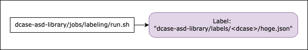

# Overview of the training/testing process

- `dcase-asd-toolkit/jobs/asd/base/base.sh` automatically executes training/testing process using `asdkit/bin/train.py` and `asdkit/bin/test.py`
- `dcase-asd-toolkit/jobs/asd/example/run.sh` is an wrapper script of `base.sh`
- Please refer `run.sh`. It includes an explanation of which configuration file will be used

# Label

- Several basic labels are provided in `dcase-asd-toolkit/labels`.
- You can also create your own label (See `asdkit/bin/label.py`, `config/label`, and `jobs/labeling/base.sh`)

