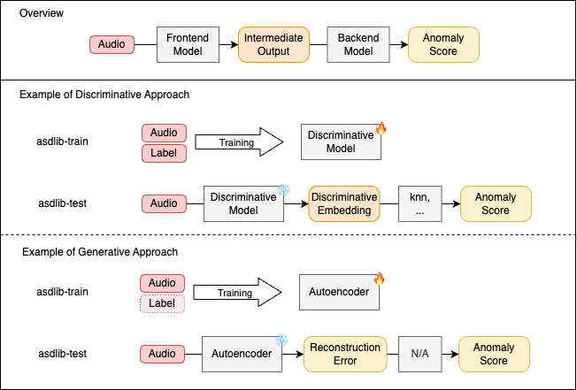

# Overview of the training/testing process

- `dcase-asd-library/jobs/asd/base/base.sh` automatically executes training/testing process using `asdlib-train` and `asdlib-test`
- `dcase-asd-library/jobs/asd/example/run.sh` is an wrapper script of `base.sh`
- Please refer `run.sh`. It includes an explanation of which configuration file will be used

